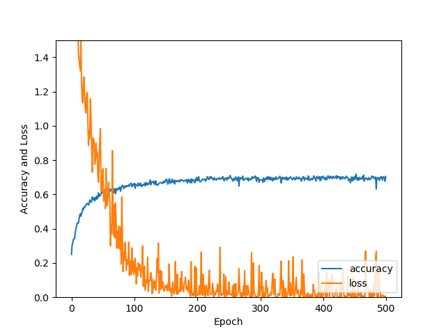
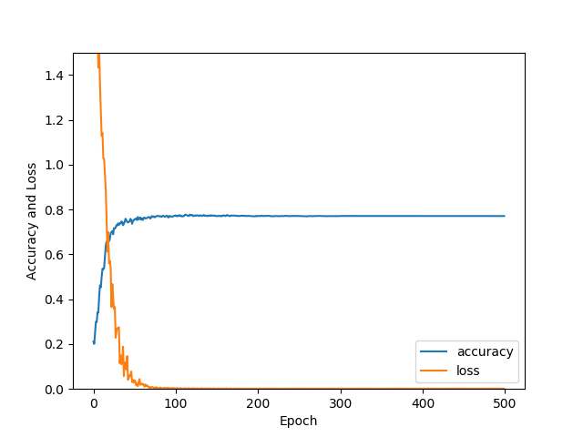
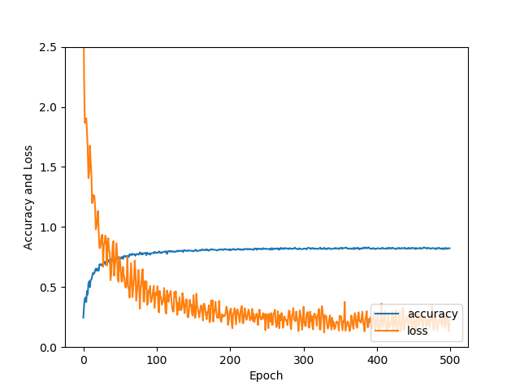

The following is the result of the model I trained last time. It has high loss and variance, with a low accuracy of 69%.

This week I tried two versions of models. The following is the one with four layers of CNN, with accuracy 78%. I increased the number of 
tensors in some layers and had different dropout value in each layer. See figure 2.

Figure 3 is the result of the other version. It has six layers of CNN, with dropout, L2 regularization, with accuracy 84%. However, I did not succeed in reducing
the loss and variance of this version. I am not sure if it is the problem of learning rate, because I set learning rate to decay over time.

The code of learning rate:

global_step = tf.Variable(0, trainable=False)

learning_rate = tf.compat.v1.train.exponential_decay(0.001, global_step, 1000, 0.9)

//l2 is the list of l2-regularization of each layer

cost = tf.reduce_mean(tf.losses.softmax_cross_entropy(logits=logits, onehot_labels=y)) + l2[0] + l2[1] + l2[2] + l2[3] + l2[4] + l2[5]

optimizer = tf.compat.v1.train.AdamOptimizer(learning_rate=learning_rate).minimize(cost,global_step) 

The code of CNN is here:

def conv_net(x,keep_prob):

    #L2 regularization

    l2 = []
    
    conv1_filter = tf.Variable(tf.truncated_normal(shape=[3, 3, 3, 32], mean=0, stddev=0.08))
    conv2_filter = tf.Variable(tf.truncated_normal(shape=[3, 3, 32, 32], mean=0, stddev=0.08))
    conv3_filter = tf.Variable(tf.truncated_normal(shape=[3, 3, 32, 64], mean=0, stddev=0.08))
    conv4_filter = tf.Variable(tf.truncated_normal(shape=[3, 3, 64, 64], mean=0, stddev=0.08))
    conv5_filter = tf.Variable(tf.truncated_normal(shape=[3, 3, 64, 128], mean=0, stddev=0.08))
    conv6_filter = tf.Variable(tf.truncated_normal(shape=[3, 3, 128, 128], mean=0, stddev=0.08))

    conv1 = tf.nn.conv2d(x, conv1_filter, strides=[1,1,1,1], padding='SAME')
    conv1_l2 = 1e-4*tf.nn.l2_loss(conv1)
    l2.append(conv1_l2)
    conv1 = tf.nn.relu(conv1)
    conv1_bn = tf.layers.batch_normalization(conv1)

    conv2 = tf.nn.conv2d(conv1_bn, conv2_filter, strides=[1,1,1,1], padding='SAME')
    conv2_l2 = 1e-4*tf.nn.l2_loss(conv2)
    l2.append(conv2_l2)
    conv2 = tf.nn.relu(conv2)
    conv2_pool = tf.nn.max_pool(conv2, ksize=[1,2,2,1], strides=[1,2,2,1], padding='SAME')
    conv2_bn = tf.layers.batch_normalization(conv2_pool)
    conv2_bn = tf.nn.dropout(conv2_bn, 0.8)

    conv3 = tf.nn.conv2d(conv2_bn, conv3_filter, strides=[1,1,1,1], padding='SAME')
    conv3_l2 = 1e-4*tf.nn.l2_loss(conv3)
    l2.append(conv3_l2)
    conv3 = tf.nn.relu(conv3)
    conv3_bn = tf.layers.batch_normalization(conv3)

    conv4 = tf.nn.conv2d(conv3_bn, conv4_filter, strides=[1,1,1,1], padding='SAME')
    conv4_l2 = 1e-4*tf.nn.l2_loss(conv4)
    l2.append(conv4_l2)
    conv4 = tf.nn.relu(conv4)
    conv4_pool = tf.nn.max_pool(conv4, ksize=[1,2,2,1], strides=[1,2,2,1], padding='SAME')
    conv4_bn = tf.layers.batch_normalization(conv4_pool)
    conv4_bn = tf.nn.dropout(conv4_bn, 0.7)

    conv5 = tf.nn.conv2d(conv4_bn, conv5_filter, strides=[1,1,1,1], padding='SAME')
    conv5_l2 = 1e-4*tf.nn.l2_loss(conv5)
    l2.append(conv5_l2)
    conv5 = tf.nn.relu(conv5)
    conv5_bn = tf.layers.batch_normalization(conv5)

    conv6 = tf.nn.conv2d(conv5_bn, conv6_filter, strides=[1,1,1,1], padding='SAME')
    conv6_l2 = 1e-4*tf.nn.l2_loss(conv6)
    l2.append(conv6_l2)
    conv6 = tf.nn.relu(conv6)
    conv6_pool = tf.nn.max_pool(conv6, ksize=[1,2,2,1], strides=[1,2,2,1], padding='SAME')
    conv6_bn = tf.layers.batch_normalization(conv6_pool)
    conv6_bn = tf.nn.dropout(conv6_bn, 0.6)

    flat = tf.contrib.layers.flatten(conv6_bn)

    out = tf.contrib.layers.fully_connected(inputs=flat, num_outputs=10, activation_fn=None)
    return out, l2

In addition, I looked into some papers about Cifar10 training but cannot reproduce their networks due to my limited GPU memory. They have accuracy about 
93%. For example: https://arxiv.org/pdf/1412.6806.pdf. 
As for the visualization of layer output, my laptop has some issue with tensorboard and it cannot display tf.image.summary at this moment. I apologize for this.

Epoch 95, CIFAR-10 Batch 3:  Loss:     0.1117 Validation Accuracy: 0.853600
Epoch 95, CIFAR-10 Batch 4:  Loss:     0.1500 Validation Accuracy: 0.852800
Epoch 95, CIFAR-10 Batch 5:  Loss:     0.1136 Validation Accuracy: 0.852200
Epoch 96, CIFAR-10 Batch 1:  Loss:     0.1264 Validation Accuracy: 0.854000
Epoch 96, CIFAR-10 Batch 2:  Loss:     0.1318 Validation Accuracy: 0.854200
Epoch 96, CIFAR-10 Batch 3:  Loss:     0.1130 Validation Accuracy: 0.853800
Epoch 96, CIFAR-10 Batch 4:  Loss:     0.1500 Validation Accuracy: 0.854400
Epoch 96, CIFAR-10 Batch 5:  Loss:     0.1133 Validation Accuracy: 0.853800
Epoch 97, CIFAR-10 Batch 1:  Loss:     0.1254 Validation Accuracy: 0.854000
Epoch 97, CIFAR-10 Batch 2:  Loss:     0.1341 Validation Accuracy: 0.854400
Epoch 97, CIFAR-10 Batch 3:  Loss:     0.1122 Validation Accuracy: 0.853800
Epoch 97, CIFAR-10 Batch 4:  Loss:     0.1474 Validation Accuracy: 0.854000
Epoch 97, CIFAR-10 Batch 5:  Loss:     0.1114 Validation Accuracy: 0.854600
Epoch 98, CIFAR-10 Batch 1:  Loss:     0.1248 Validation Accuracy: 0.853400
Epoch 98, CIFAR-10 Batch 2:  Loss:     0.1321 Validation Accuracy: 0.854400
Epoch 98, CIFAR-10 Batch 3:  Loss:     0.1130 Validation Accuracy: 0.854200
Epoch 98, CIFAR-10 Batch 4:  Loss:     0.1502 Validation Accuracy: 0.854000
Epoch 98, CIFAR-10 Batch 5:  Loss:     0.1125 Validation Accuracy: 0.853600
Epoch 99, CIFAR-10 Batch 2:  Loss:     0.1326 Validation Accuracy: 0.853400
Epoch 99, CIFAR-10 Batch 3:  Loss:     0.1132 Validation Accuracy: 0.854000
Epoch 99, CIFAR-10 Batch 4:  Loss:     0.1519 Validation Accuracy: 0.853400
Epoch 99, CIFAR-10 Batch 5:  Loss:     0.1131 Validation Accuracy: 0.853200
Epoch 100, CIFAR-10 Batch 1:  Loss:     0.1254 Validation Accuracy: 0.853600
Epoch 100, CIFAR-10 Batch 2:  Loss:     0.1312 Validation Accuracy: 0.853400
Epoch 100, CIFAR-10 Batch 3:  Loss:     0.1129 Validation Accuracy: 0.853600
Epoch 100, CIFAR-10 Batch 4:  Loss:     0.1516 Validation Accuracy: 0.854200
Epoch 100, CIFAR-10 Batch 5:  Loss:     0.1137 Validation Accuracy: 0.853000