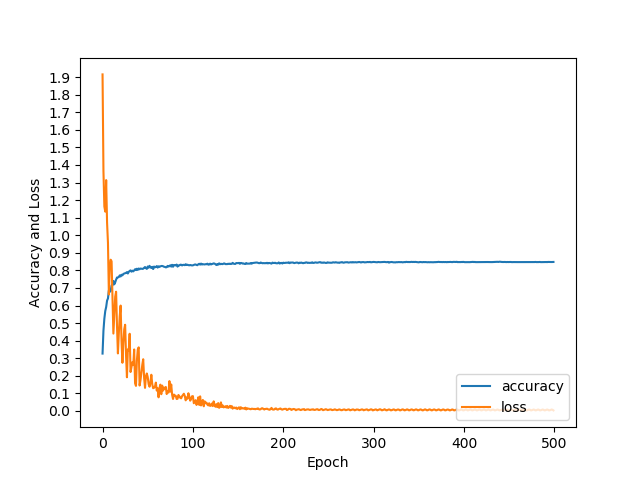
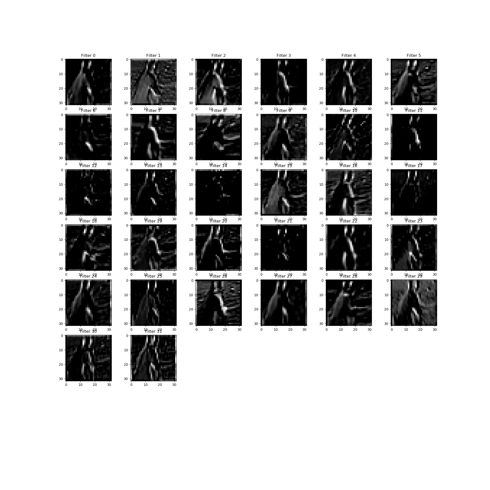
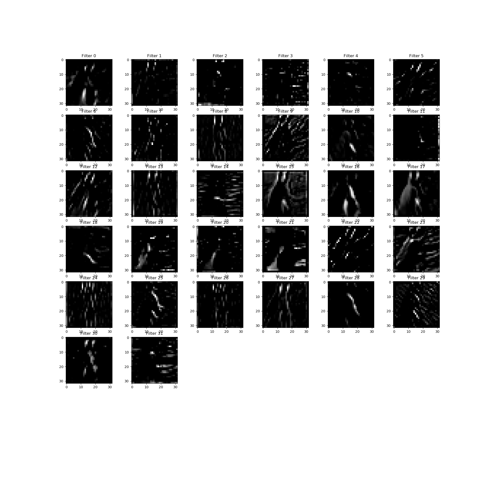
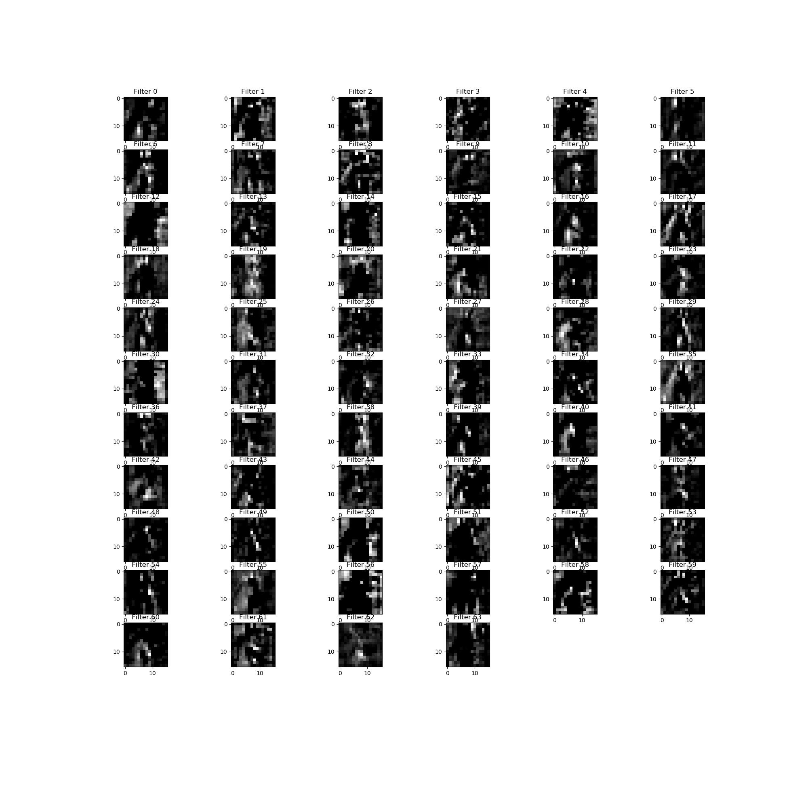
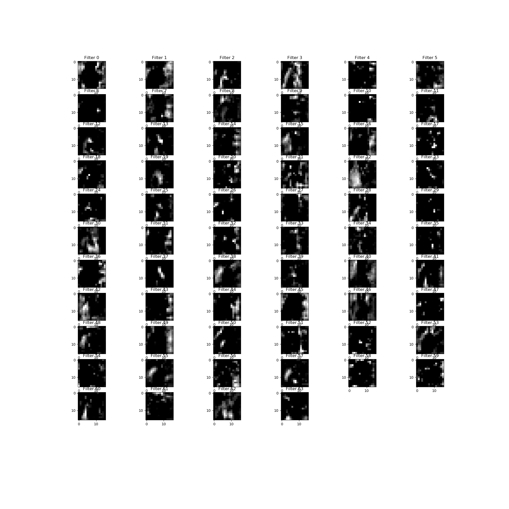
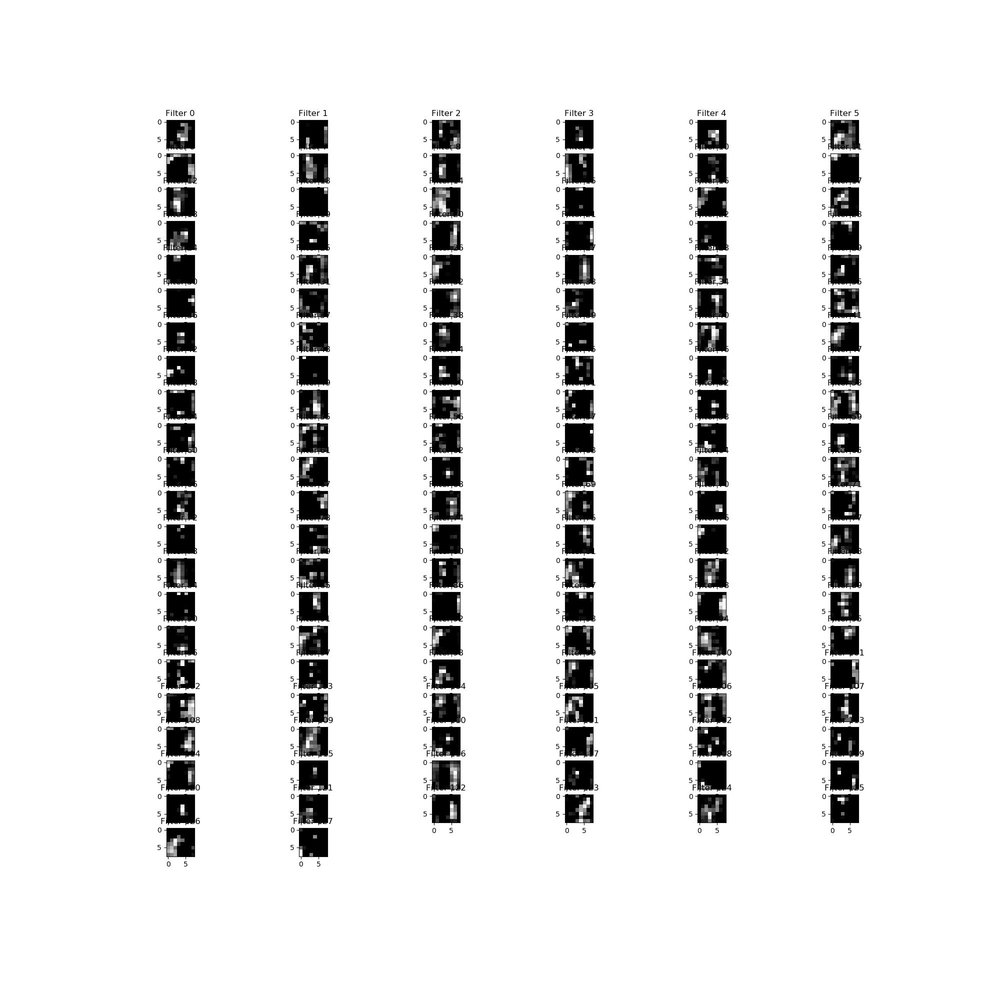
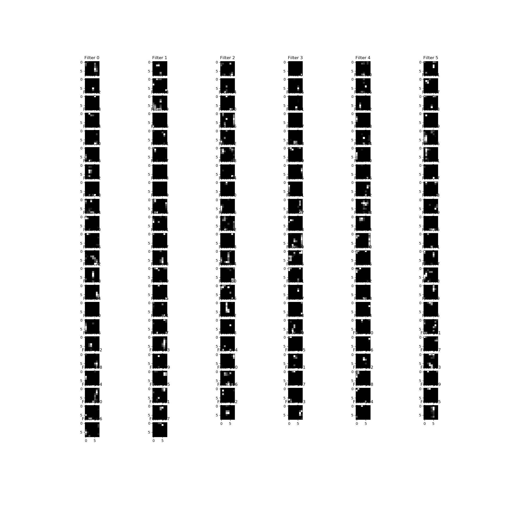

The model is basically the same as last time, with 6 layers of CNN. I tried fewer blocks but those models did not reach 85% accuracy. For the final model I used, the only changes I made were to rescale dropout probability during testing and get rid of l2 regularization, so that there is no weird loss fluctuation anymore with a better accuracy. The result is as following, and please see figure 1 for learning curve:

Epoch 99, CIFAR-10 Batch 3:  Loss:     0.1132 Validation Accuracy: 0.854000  
Epoch 99, CIFAR-10 Batch 4:  Loss:     0.1519 Validation Accuracy: 0.853400  
Epoch 99, CIFAR-10 Batch 5:  Loss:     0.1131 Validation Accuracy: 0.853200  
Epoch 100, CIFAR-10 Batch 1:  Loss:     0.1254 Validation Accuracy: 0.853600  
Epoch 100, CIFAR-10 Batch 2:  Loss:     0.1312 Validation Accuracy: 0.853400  
Epoch 100, CIFAR-10 Batch 3:  Loss:     0.1129 Validation Accuracy: 0.853600  
Epoch 100, CIFAR-10 Batch 4:  Loss:     0.1516 Validation Accuracy: 0.854200  
Epoch 100, CIFAR-10 Batch 5:  Loss:     0.1137 Validation Accuracy: 0.853000  

As for the test cases when there is no dropout, no batch normalization.  

The result of no dropout:  (converge at around epoch 35)  
Epoch 35, CIFAR-10 Batch 3:  Loss:     0.0000 Validation Accuracy: 0.788200  
Epoch 35, CIFAR-10 Batch 4:  Loss:     0.0000 Validation Accuracy: 0.788000  
Epoch 35, CIFAR-10 Batch 5:  Loss:     0.0000 Validation Accuracy: 0.787800  
Epoch 36, CIFAR-10 Batch 1:  Loss:     0.0000 Validation Accuracy: 0.787000  
Epoch 36, CIFAR-10 Batch 2:  Loss:     0.0000 Validation Accuracy: 0.787600  
Epoch 36, CIFAR-10 Batch 3:  Loss:     0.0000 Validation Accuracy: 0.788400  

The result of no batch normalization:  

Epoch 99, CIFAR-10 Batch 4:  Loss:     0.1168 Validation Accuracy: 0.836200  
Epoch 99, CIFAR-10 Batch 5:  Loss:     0.1102 Validation Accuracy: 0.835600  
Epoch 100, CIFAR-10 Batch 1:  Loss:     0.1828 Validation Accuracy: 0.835600  
Epoch 100, CIFAR-10 Batch 2:  Loss:     0.1791 Validation Accuracy: 0.835800  
Epoch 100, CIFAR-10 Batch 3:  Loss:     0.0966 Validation Accuracy: 0.835600  
Epoch 100, CIFAR-10 Batch 4:  Loss:     0.1166 Validation Accuracy: 0.835600  
Epoch 100, CIFAR-10 Batch 5:  Loss:     0.1108 Validation Accuracy: 0.835400  

Figure 2 is the learning curve of no batch normalization. Obviously, there is obvious loss fluctuation; yet, the accuracy is close to the model with normalization.  

  

The following is the layer visualization of six convolutional layers. Due to my use of many tensors, it might be blurry for 128 filter outputs in one image, but layer 1 and layer 2 have good resolution.

  

  
  
  
  
  

